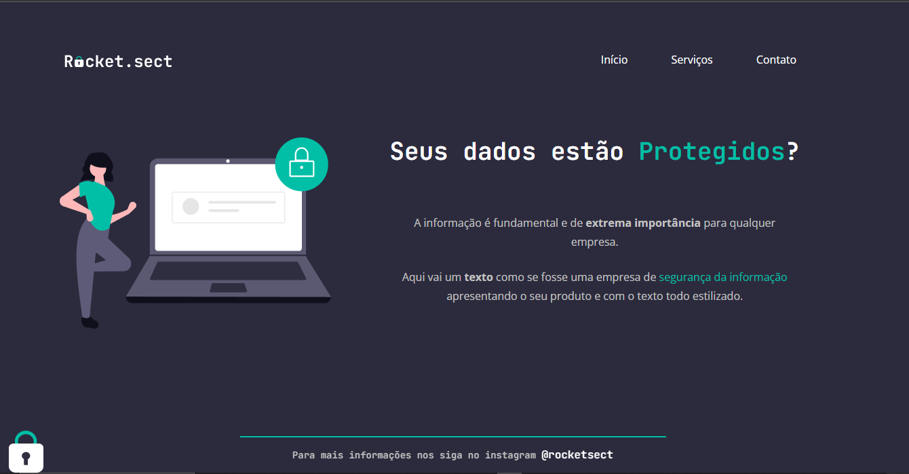

<h1 align="center"> Rocket Sect</h1>

Este desafio permite aos participantes a oportunidade de aprimorar suas habilidades em criação de páginas web, desenvolvendo competências em design e layout, organização de conteúdo e navegação intuitiva. 

  <a href="#-minhas">Minhas alteraões</a>&nbsp;&nbsp;&nbsp;|&nbsp;&nbsp;&nbsp;
  <a href="#-tecnologias">Tecnologias</a>&nbsp;&nbsp;&nbsp;|&nbsp;&nbsp;&nbsp;
  <a href="#-layout">Layout</a>&nbsp;&nbsp;&nbsp;|&nbsp;&nbsp;&nbsp;
  <a href="#memo-licença">Licença</a>

  

 

## Minhas alterações

  

## 🚀 Tecnologias

Esse projeto foi desenvolvido com as seguintes tecnologias:

- HTML e CSS
- Figma
- Git e GitHub

## 🔖 Layout

Você pode visualizar o layout do projeto através [DESSE LINK](https://www.figma.com/file/VSViEpqHH2CXqc4p5tdFjf/Explorer-(Copy)?node-id=16%3A106&t=i6ytbP56qwANOphq-0). É necessário ter conta no [Figma](https://figma.com) para acessá-lo.

## :memo: Licença

Esse projeto está sob a licença MIT.

---

Feito com ♥ by Damara Santos/Rocketseat :wave: [Participe da nossa comunidade!](https://discord.gg/rocketseat)